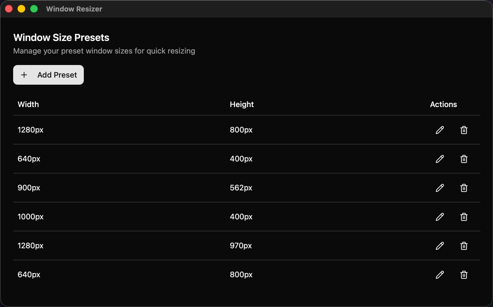

# WindowResizer

A cross-platform (macOS & Windows) system tray utility to quickly resize the active window to your predefined dimensions.

_Manage your custom window size presets easily._

## ✨ Features

- **Cross-Platform:** Supports both macOS and Windows.
- **System Tray Access:** Lives in your system tray / menu bar for easy access.
- **Active Window Resizing:** Instantly resizes the _currently active_ window.
- **Custom Presets:** Define your own preferred window dimensions (width x height).
- **Simple Management:** Add, edit, and delete presets through an intuitive preferences window.

## 🚀 Installation

1. Go to the [**Releases page**](https://github.com/rxliuli/window-resizer/releases).
2. Download the latest installer for your platform:
   - **macOS:** `.dmg` file — open it and drag `WindowResizer.app` to your `/Applications` folder. You may need to grant accessibility permissions when prompted.
   - **Windows:** `.exe` installer — run it and follow the setup wizard.

## ⚙️ How to Use

1. **Launch the Application:** Start `WindowResizer`. Its icon will appear in your system tray / menu bar.
2. **Resize a Window:**
   - Make sure the window you want to resize is the _active_ (frontmost) window.
   - Click the application icon in the system tray / menu bar.
   - Select one of your predefined "Resize to WxH" options (e.g., "Resize to 1280x800").
   - The active window will instantly snap to that size.
3. **Manage Presets:**
   - Click the application icon in the system tray / menu bar.
   - Select "Preferences".
   - In the "Window Size Presets" window:
     - Click **+ Add Preset** to create a new size definition. Enter the desired Width and Height (in pixels) and save.
     - Click the **pencil icon (✎)** next to a preset to edit its dimensions.
     - Click the **trash can icon (🗑️)** next to a preset to delete it.
   - Changes are reflected immediately in the menu bar list.
4. **Quit:**
   - Click the application icon in the system tray / menu bar.
   - Select "Quit".

## 🛠️ Built With

- **Wails:** For creating the cross-platform desktop application shell.
- **React:** For the Preferences UI.

## 🤝 Contributing

Contributions are welcome! If you have suggestions or find bugs, please open an issue on the [GitHub Issues page](https://github.com/rxliuli/window-resizer/issues). If you'd like to contribute code, please fork the repository and submit a pull request.

## 📄 License

This project is licensed under the [GPL-3.0 License](./LICENSE).
